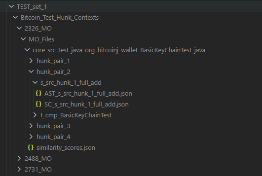
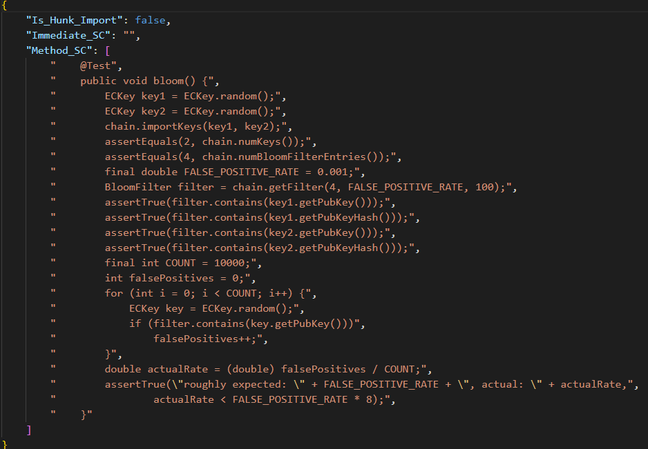

<!-- #region Summary -->

<details> <summary><h2 style="display: inline;">Summary</h2></summary>
<br>
A program that extracts info from the output of GACPD.<br>
The extractions include:

1. A summary of the results of GACPD including hunk similarity data.
2. The AST representation of the context of every qualified hunk
3. The source code of the context of every qualified hunk
4. The metadata of each GACPD-detected hunk's context.
</details>
<br><br>

<!-- #endregion -->

<!-- #region Required Packages -->
<details> <summary><h2 style="display: inline;">Required Packages</h2></summary>
<br>
Install the following packages before running the program:  

<h3>Python</h3>

* `Python==3.10.11+`
* `tree-sitter==0.25.2`
* `tree-sitter-java==0.23.5`
* `unidiff==0.7.5`  
<h3>Other</h3>

* `RefactoringMiner==3.0`
* `Gradle==your project's version`
* `Java==your project's version`
</details>
<br><br>

<!-- #endregion -->

<!-- #region Configuration -->

<details>
<summary><h2 style="display: inline;">Configuration</h2></summary>
<br>
Create a file in the main directory of the repository calld "Config.py"<br>
and copy the content of the file "Config_Template.txt" (also within the main directory)<br>
into "Config.py".<br>
<br>
<b>Config.py Members</b>

```yaml
output_folder : The folder for the output of the main program (main.py)  
GACPD_project_folder_name : The name of the GACPD project folder, note that this could be different from the GACPCD project name, particularly when it is run in 1 pr mode  
GACPD_results_folder : The absolute address of the results folder of GACPD. This is located within the GACPD subdirectories.  
Refactoring_Miner_Address : The absolute address of RefactoringMiner's install directory.
should_take_in_ED_PRs : should the main program take in effort duplication PR's?
should_take_in_MO_PRs : should the main program take in missed opportunity PR's?
should_take_in_ED_files : should the main program take in effort duplication files?
should_take_in_MO_files : should the main program take in missed opportunity files?
should_json_be_hierarchical : This is for the GACPD_Result_Processing.py file within the GACPD_output_processing folder.  
Should the script output a hierarchical json or should it be flat?
should_generate_pre_patch_methods : Should the main loop generate info about the pre-patch methods for each hunk context? If this is true, the inputted token will be used.
```
</details>
<br><br>

<!-- #endregion -->

<!-- #region Token -->

<details>
<summary><h2 style="display : inline;">Token</h2></summary>
<br>
Create a file in the directory "Refactoring_Detection" and name it "github-oauth.properties".<br>
Copy the content of the file "github-oauth.properties.template" (also in the same directory)<br>
according to the instructions within it into the "github-oauth.properties" file. Then<br>
replace the "YOUR_GITHUB_TOKEN_HERE" with your Github token.<br>
</details>
<br><br>

<!-- #endregion -->

<!-- #region Running The Program -->

<details>
<summary><h2 style="display : inline;">Running The Program</h2></summary>
<br>
To run the main components of the program:<br>
First look at the Configuration and Token sections of this README and set those up.<br>
Then run the command "python Main.py" in the main directory to extract hunk info and <br>
context for each GACPD-detected hunk. Note: you can run "python Main.py --DebugPrint 1" <br>
to enable debug printing mode, which will show what files and PR's the script is working<br>
 on as it goes through the GACPD output.<br>
</details>
<br><br>

<!-- #endregion -->

<!-- #region Expected Outputs -->

<details>
<summary><h2 style="display : inline;">Expected Outputs</h2></summary>
<br>
The output directory of Main.py is specified by the user (see Configuration).<br>
Within that output folder, Main.py will create a subfolder which whose name will contain the<br>
original GACPD project name (specified by user in the configuration).<br>
This folder contains the PR folders, and each PR folder will contain classification folders<br>
(MO or ED or both depending on the user's specification in the Configuration). Each classification<br>
folder contains file folders. Each file folder contains hunk-pair folders as well as the similarity scores<br>
for that file. Each hunk-pair folder contains the folders for the source and target areas. Each of these area<br>
folders will contain that specific area's and its encapsulating method's AST representation and source code. For<br> 
the source area, the prepatch method is also included (as long as the user enabled it in the Configuration).<br>
<br>
An example of the output folder structure:  
<p align="left">
  
</p>
An example of a returned encapsulating method source code:  
<p align="left">
  
</p>
</details>
<br><br>
<!-- #endregion -->